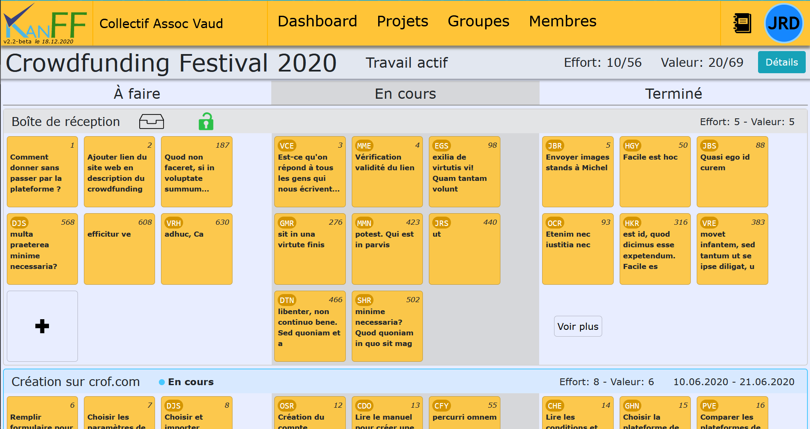
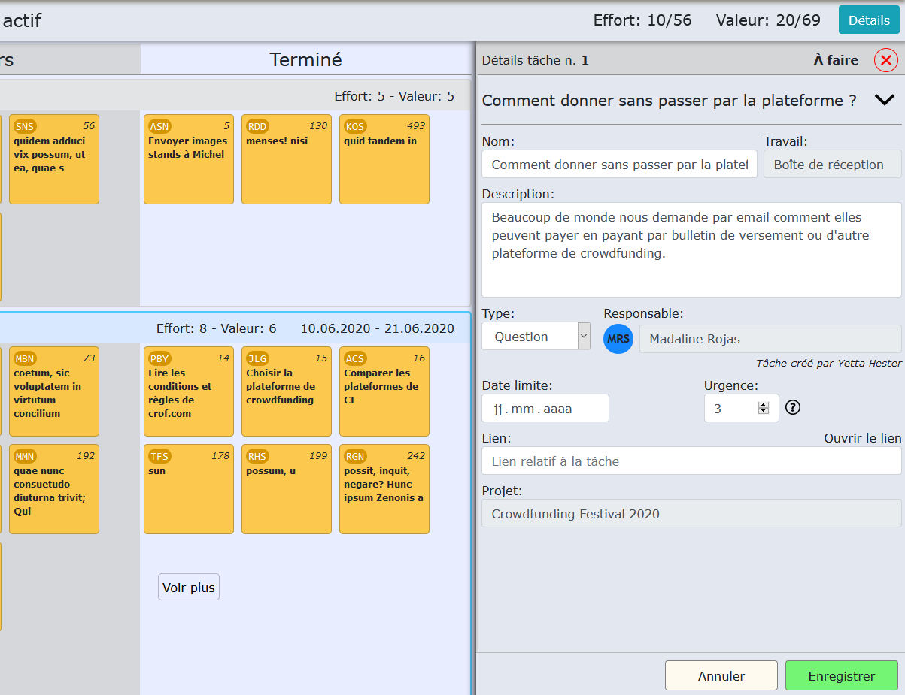

<!--/**
 *  Project: KanFF
 *  File: kanff-doc-fr.md technical doc of KanFF
 *  Author: Samuel Roland
 *  Relecture: Benoît Pierrehumbert
 *  Creation date: 24.06.2020
 */ -->
# KanFF

## Une application web (opensource) de gestion de projets, de tâches, et d'organisation du travail, conçue pour le milieu militant et associatif.
### Structure de l'application
Quand un collectif utilise KanFF, les membres du collectif ont un compte et rejoignent des groupes. Les groupes réalisent 0, 1 ou plusieurs projets (les projets sont réalisés par 1 ou plusieurs groupes).

Chaque projet a un kanban et est divisé en parties appelées "travaux". Ceux-ci contiennent des tâches relatives à ce travail.
La gestion de toutes ces tâches et travaux dans les différents projets se fait collaborativement à travers le kanban et les détails du projet. Les événements importants relatifs à un projet sont consignés par les membres dans un journal de bord.

#### Le kanban
Le kanban du projet `Crowdfunding Festival 2020` pour le collectif fictif `Collectif Assoc Vaud`.

Les détails d'une tâche (numéro 1) sur le kanban du projet `Crowdfunding Festival 2020` pour le collectif fictif `Collectif Assoc Vaud`.

## Contexte d'utilisation
L'application est pensée pour être utilisée par **des membres de collectifs, d'organisations, de mouvements, d'associations ou de simples groupes ayant des projets communs.**  
L'application se veut **polyvalente** et devrait pouvoir être utilisée dans des groupes de différentes tailles, structures, objectifs et organisation du travail, et réalisant des projets de nature différente, ...
*Pour l'instant, une instance KanFF ne peut pas héberger plusieurs collectifs*.

## Objectif de l'application
L'application doit permettre: de **gérer des projets, gérer des tâches**, la répartition du travail, de planifier des projets, de gérer les **membres** et les **groupes**, ... afin de **collaborer à plusieurs sur des projets**, avoir une **vision d'ensemble large** (de tous les projets, travaux, tâches, groupes et membres du collectif), mieux répartir la charge de travail, inclure de nouvelles personnes et aussi les personnes moins engagées...

### Publications prévues ou passées (releases)
- [x] KanFF Beta v1.0, le 19.06.2020
- [x] KanFF Beta v2.0, le 13.11.2020
- [ ] **KanFF v1.0**, le 29.01.2021

D'autres petites publications sont faites entre ces grosses publications à la fin de chaque sprint (0.1-beta, 0.2-beta, 1.1-beta, 1.2-beta, 2.1-beta, 2.2-beta).

## Beta tests
Durant le projet il sera demandé à des membres de différentes organisations ou personnes extérieures au projets, d'aller tester l'application sur différentes versions afin de donner des retours sur le design, la conception des fonctionnalités, de nouvelles propositions, ... par écrit et/ou par le formulaire de feedback intégré.
L'instance de tests est mise à jour toutes les 2-3 semaines (en fin de sprint) sur [kanff.mycpnv.ch/](https://kanff.mycpnv.ch/) et en plus régulièrement sur [kanff.mycpnv.ch/temp](https://kanff.mycpnv.ch/temp).
L'indication de la version de l'application (ainsi que la date de publication) se trouve sous le logo dans le menu, ou sur la dernière entrée du fichier `app/version.php`.

## Contact
**Cette application vous intéresse ?** Vous avez des questions, des suggestions, des remarques, des critiques constructives, sur l'application ou le projet ? Vos idées nous intéressent ! Écrivez-nous à kanff[ate]pm.me en français ou en anglais. *(OpenPGP:`de52d839a9baf0486f6049761500b58971c1047f`)*. Si vous avez un compte GitHub mettez-nous une étoile !

## Informations sur le projet
### Documentations
Les documentations sont pour certaines en cours d'écriture ou incomplètes...

#### Documentation utilisateur
- [Documentation utilisateur](doc/kanff-doc-user-fr.md) (en cours)

#### Documentations techniques (développement)
- [Documentation globale](doc/kanff-doc-fr.md)(en cours)
- [Liste des pages (prévues et réalisées)](list-pages.md)
- [Fonctions d'aide](helpers-functions.md)(en cours)
- [Spécifications de la base de données](db-specifications.md)
- [Structure des appels Ajax](structure-ajax-calls.md)

### Avancement du projet
Le projet a commencé le 23.04.2020 et est en développement actif. Il n'y a pas encore de version assez complète pour être utilisable (uniquement des versions bêta). La première version utilisable (`v1.0`) est prévue pour le 29.01.2021 (il est possible qu'il y ait du retard). Il y a actuellement beaucoup de petits bogues et de fonctionnalités commencées et non terminées. La sécurité est implémentée en partie (basiquement contre les injections SQL, l'accès à des ressources non-autorisées et le CSRF, mais par contre le XSS, l'upload de fichiers, ...). Un document sur la sécurité sortira avant la version 1.0.

### Contributions
- Si vous avez trouvé un bogue, [créer un issue](https://github.com/samuelroland/KanFF/issues) et détailler le problème.
Si vous êtes intéressé·e à contribuer, nous nous en réjouissons. Nous n'avons pas encore de lignes directrices pour les contributions, alors n'hésitez pas à nous envoyer un email pour nous motiver à les écrire (et nous dire au passage sur quoi vous aimeriez aider : code, documentation, design, autres) ... Vous pouvez sans hésiter ouvrir une issue également.

### Feuille de route
Fonctionnalité prévues pour la version `v1.0` (~29.01.2021) :
- Gestion des membres
- Gestion des groupes
- Gestion des projets (inclut projets, travaux, tâches, groupes participants et journaux de bord)

Fonctionnalité prévues pour les versions **après** la `v1.0` (pas de date définie pour l'instant) :
- Gestion des collectifs (plusieurs collectifs par instance)
- Gestion des événements (dans un calendrier)
- Gestion notifications
- Gestion des compétences

### Gestion du projet
[Repository GitHub](https://github.com/samuelroland/KanFF) | [Projet IceScrum](https://cloud.icescrum.com/p/PWB2AGDC)  
Le repository GitHub est public, mais le projet IceScrum est privé. Le projet est géré selon la méthodologie Scrum.

### Objectif du projet
Réaliser l'application KanFF permettant la gestion des membres, groupes et projets, pour une version `KanFF v1.0` publiée sur GitHub.

## Installation (pour une instance)
Cette procédure s'applique pour une instance à distance.
A venir.
<!--
### Prérequis:
1. Accès SSH
1. Accès FTP
1. Accès MySQL à distance (facultatif)

### Procédure:
1. Récupérer les fichiers de l'application du dossier app.
TBD.

### Sécurité
TBD. fichiers.
-->
## Installation locale (pour développement)
### Prérequis:
- Avoir un service `Php` (version 7.3.x à 7.4.x) et `MySQL` (mysql v8.0.x) installé et pouvoir les atteindre dans un shell (tester `php -v` et `mysql -v` pour vérifier. Les variables d'environnement doivent être définies. Vérification réussie si la commande est reconnue... Cela sera utile pour la mise à jour de la base de données et l'exécution des tests unitaires). Installation possible avec [Chocolatey](https://chocolatey.org/) notamment.
- Avoir l'extension PDO activée sur le serveur Php (changer `;extension=pdo_mysql` par `extension=pdo_mysql` dans le fichier `php.ini` ou vérifier que c'est déjà fait).

### Procédure:
1. **Récupérer le repository** depuis GitHub (clone ou téléchargement `.zip`) (exemple de clone dans un shell dans le dossier `C:/Alice/Documents/GitHub/`)

        C:
        cd C:/Alice/Documents/GitHub/
        git clone https://github.com/samuelroland/KanFF

1. Ouvrir un shell et **installer les dépendances** avec [`npm`](https://www.npmjs.com/get-npm) dans le dossier `app` ! Un dossier `node_modules` et un fichier `package-lock.json` apparaissent.

        cd app
        npm install

1. Démarrer le service MySQL. Se connecter (avec un client SQL par ex.) en compte `root`. Executer le fichier `db/db-manage/create-db-kanff.sql`, ce qui a pour effet de **créer la base de données** `kanff` et ses tables. Ensuite **créer un nouvel utilisateur** (nommé dans ici `kanffApp` avec `Pa$$w0rd` pour mot de passe) et lui donner accès à la base de données `kanff` précédemment créée. Se connecter au nouvel utilisateur afin de vérifier qu'il a bien été créé et qu'il accède à la base de données `kanff`.
1. Aller dans `app`. Dupliquer le fichier `.const.php.example` et renommer le en `.const.php`.
1. Démarrer un IDE à la racine du repository. Modifier les valeurs du fichier `.const.php` afin d'**inscrire les identifiants** de connexion à la base de donnée (4 valeurs + un cartouche).

        $user = "kanffApp";
        $pass = "Pa\$\$w0rd";   //Caractères spéciaux php doivent être précédé de \
        $dbhost = "localhost";
        $dbname = "kanff";

1. Lancer le fichier `db/db-manage/restore-db-kanff.bat` (ou alors lancer la commande `php -f restore-db.php` dans `db/db-manage/`) afin d'**insérer les données** du pack "Collective Assoc Vaud". La base de données est maintenant créée. Ce script .bat est utile pour restaurer très rapidement la base de données lors du développement ou de tests.
1. Démarrer un serveur PHP **dans le dossier `app`** (pas le dossier racine du repository!) sur un port libre (ici 8080).
1. **Ouvrir un navigateur web** sur l'adresse localhost et le port choisi: `localhost:8080`.
1. **Validation**: L'installation est terminée lorsque le site s'affiche correctement dans le navigateur (page de login affichée et style CSS semblable à la version du [serveur de tests](https://kanff.mycpnv.ch)) et lorsque que le login fonctionne. Tester avec les identifiants suivants:
       
        initiales: JRD
        mot de passe: Josette

Voilà. Si vous êtes bien connecté avec le compte de Josette Richard, l'installation est réussie et vous pouvez maintenant commencer à développer !  
(Si vous tombez sur l'erreur semblable à celle-ci: `Error: Could not find the driver!` alors c'est probablement parce que l'extension PDO n'a pas été activée).