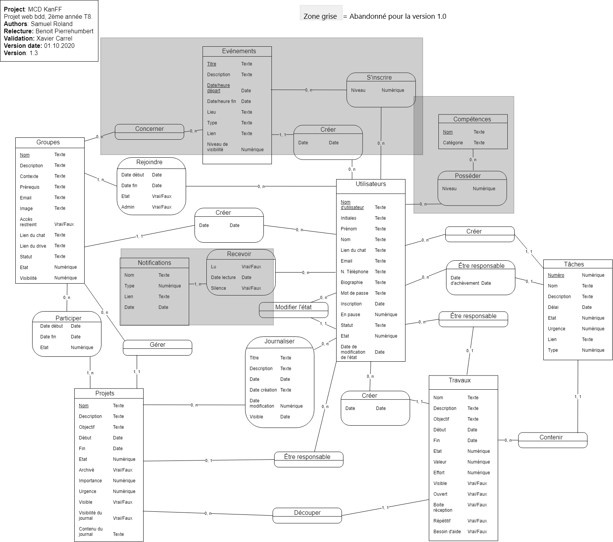
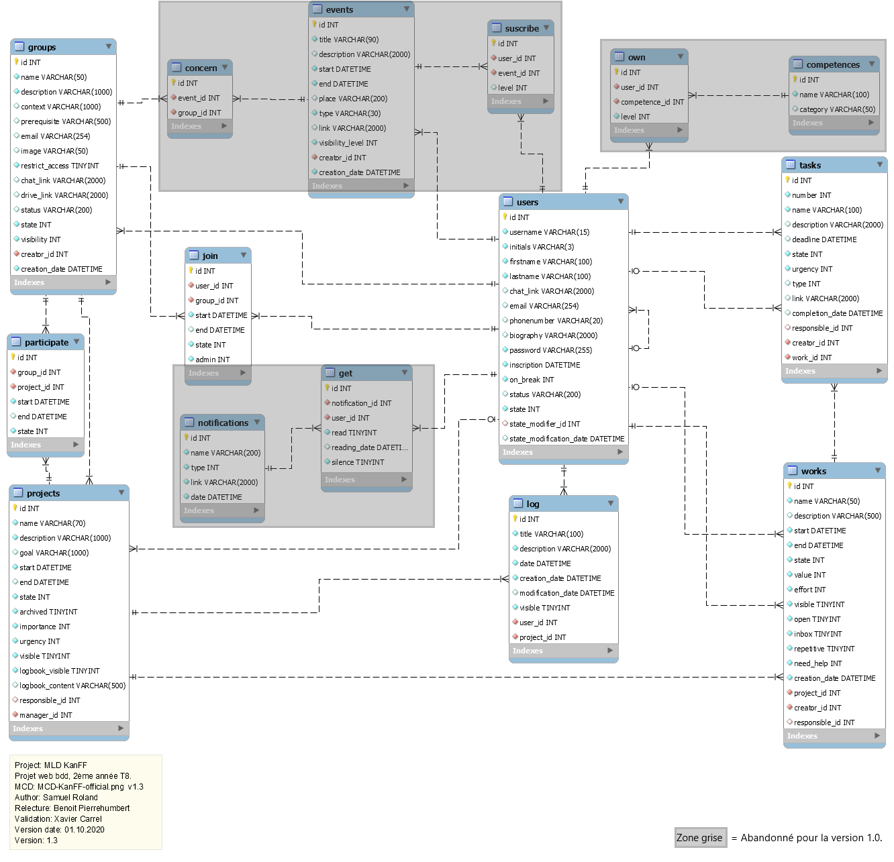

# Database specifications
These are the full specifications of the database of the KanFF (the tables, fields, the effect of part of values, ...).

## Table of content
<!-- MDTOC maxdepth:6 firsth1:1 numbering:0 flatten:0 bullets:1 updateOnSave:1 -->

- [Database specifications](#database-specifications)   
   - [Table of content](#table-of-content)   
   - [MCD and MLD](#mcd-and-mld)   
   - [List of all tables:](#list-of-all-tables)   
   - [List of all fields for each table:](#list-of-all-fields-for-each-table)   
      - [Information about the whole database:](#information-about-the-whole-database)   
      - [Users:](#users)   
      - [Groups:](#groups)   
      - [join:](#join)   
      - [Projects:](#projects)   
      - [Works:](#works)   
      - [Tasks:](#tasks)   
   - [Participate](#participate)   
   - [Log](#log)   
   - [Pack "Collectif Assoc Vaud":](#pack-collectif-assoc-vaud)   
      - [Content:](#content)   
      - [How to use it ?](#how-to-use-it)   
   - [How to generate another pack ?](#how-to-generate-another-pack)   
      - [Process](#process)   

<!-- /MDTOC -->

## MCD and MLD
MCD (`Modèle Conceptuel de Données` in french is the `Conceptual Data Model` in english)

MLD (`Modèle Logique de Données` in french is the `Logical Data Model` in english)

## List of all tables:
- `users`: list of users on the instance
- `groups`: list of groups
- `join`: joining table between users and groups, says who join which group
- `projects`: list of projects
- `works`: list of works (works are part of projects and a group of tasks)
- `tasks`: list of tasks
- `participate`: list of participations of groups to projects
- `log`: joining table representing a list of logs (not technical but project log, displayed in a logbook)

Other tables exist in the data model but are abandoned for v1.0...

## List of all fields for each table:
### Information about the whole database:
- **All tables contain an `id`** field that is the unique technical identifier for each entry in the database. To make this documentation lighter, this field isn't mentioned for each table below.
- **All the dates are stored in DATETIME format** (even if the hours, minutes, seconds level of precision is not displayed).
- **All the links are 2000 chars max long**.
- All TINYINT value are representing boolean value (MySQL doesn't support BOOL type). 0 = false and 1 = true.
- All fields representing a technical state of an element are called `state` and are always in INT type. (Example: look at users.state below). This information has an impact on the use and the permissions on the app.
- All fields given an information about the state with a text (content of this text is free) are called `status` and are always in VARCHAR type. (Example for users.status: `I'm in holiday. I'll be back the 10th. Leave me an SMS if you really need me...`). This information is not technically linked to state and has no impact on the use of the app.

### Users:
- `username`: a simple username of a maximum of 15 characters
- `initials`: initials built with firstname and lastname (first letter of firstname + first and last letter of lastname (default format)) always in uppercase. It's a unique identifier.
- `firstname`: firstname of the user
- `lastname`: lastname of the user
- `chat_link`: link to an external messaging app internal to the collective, to write in private to the user (first contact mean)
- `email`: an facultative email that can useful for other users of the collective (second contact mean, not technically used)
- `phonenumber`: a string of 20 digits for the phonenumber (third contact mean, not technically used)
- `biography`: a biography text
- `password`: the password to login hashed with password_hash() and DEFAULT_PASSWORD mode
- `inscription`: date of creation of the account
- `on_break`: if you are on break or not (of your work in the collective)
- `status`: status written by the user
- `state`: technical state of the account:
    - Values:
        - 0 = unapproved
        - 1 = approved
        - 2 = archived
        - 3 = banned
        - 4 = admin
    - Effect:
        - unapproved, archived and banned: the user has no access to internal data. The user can run these actions only: login, signin, about, sendFeedback, editAccount.
        - approved: access to internal data like a normal user (most common state)
        - admin: access to internal data and the management of members (management of their state only)
- `state_modifier_id`: As only admins can change state of users, this field store the id of the admin that change the user state for the last time
- `state_modification_date`: date of last modification of the state of the user by an admin

### Groups:
- `name`: name of the group
- `description`: description of what is the group, what is its goal and how it is organized
- `context`: why and in which context/circumstances, the group has been created.
- `prerequisite`: prerequisite to have before joining the group
- `email`: email as mean of contact for the entire group
- `image`: image name (ex: `group_2fg2k8ip25uujr77t4tfyegn4puusp.jpg`). The images are stored in folder `/data/groups/`. Naming format: `group_` + random string of 30 chars + `.jpg`
- `restrict_access`: boolean value (in tinyint). Says if the access to the group is restricted (anyone that want to join need to be moderated). This is useful for sensitive groups.
- `chat_link`: link to join the group in the internal messaging app
- `drive_link`: link of the drive or of the folder in the drive where the group store its files
- `status`: status written by members of the group
- `state`: technical state of the group:
    - Values:
        - 0 = on start-up
        - 1 = active
        - 2 = on break
        - 3 = archived
- `visibility`: This is the level of visibility of the group's details, for members of the collective external to the group. (The members of the group have access to all information about the group).
    - Values:
        - 1 = Invisible: totally invisible
        - 2 = Title visible: only name is visible
        - 3 = Standard: Fast all visible: only `chat_link` and `drive_link` are not visible. And members too. (3 is the defaut choice)
        - 4 = Totally visible: All fields of the table "groups" (without the id). And members too.
- `creator_id`: id of the user that have created the group
- `creation_date`: date of the creation of the group

### join:
Each entry represents a joining of a user to a group.
- `user_id`: the foreign key linked users.id
- `group_id`: the foreign key linked groups.id
- `start`: date of subscription (if not yet inside the group, the date is when the entry is created, then when the user is accepted, the start is updated to the date of joining)
- `end`: date of when the user has left the group or has been refused (for any reason)
- `state`: technical state of the joining:
    - A user is member of a group if state is "invitation accepted" or "approved".
    - Possible values if access is restricted:
        - 1 = unapproved
        - 2 = refused
        - 3 = invitation
        - 4 = left
        - 5 = invitation refused
        - 6 = banned
        - 7 = invitation accepted
        - 8 = approved
    - Possible values if access is not restricted:
        6 = banned
        8 = approved
- `admin`: level of admin: 0 = not an admin, 1 = is an normal admin. (no others values now).

### Projects:
- `name`: name of the group
- `description`: description of the project
- `goal`: goal/mission of the project
- `start` and `end`: start and end dates of the project (end is facultative, start can be set in the past at creation)
- `state`: technical state of the project:
    - Values:
        - 0 = under reflection
        - 1 = under planning
        - 2 = semi-active work
        - 3 = active work
        - 4 = on break
        - 5 = reported
        - 6 = abandoned
        - 7 = cancelled
        - 8 = done
- `archived`: if the project is archived or not. A project can be archived only if his state is abandoned, cancelled or completed (6, 7 or 8).
- `importance` and `urgency`: values 1 to 5 to mark importance and urgency of the project. (1 = min and 5 = max)
- `visible`: visible or not outside of the groups realizing it.
- `logbook_visible`: if the logbook is visible or not. (The logbook is the list of log in this project).
- `logbook_content`: text about the content of the logbook. The members should write a very short text to say which content should be saved in the logbook. And the text have to define what is important. For example:
    >Contains the important decisions, formal meetings, important changes and publications of new versions of documents.
    > Important means that what is described in the log, has an impact on the work of several persons in the project.
- `responsible_id`: possibility to define a user as responsible for the project
- `manager_id`: the group that manages the participants (the other groups) to the project (by default is the creator group).

### Works:
- `name`: name of the work
- `description`: simple description of what will be done in this work
- `start` and `end`: date of start and end of the work. Is useful to make a planning.
- `state`: technical state of the work (this field is independent of dates about the work. changes are only manual)
    - Values:
        - 1 = to do
        - 2 = in run
        - 3 = on break
        - 4 = done
- `value`: value of the "work" made in this work. INT value between 1 and 10 (1 = min and 10 = max).
- `effort`: estimation of the effort to bring to achieve this work. INT value between 1 and 10 (1 = min and 10 = max).
- `visible`: if the work is visible or not outside of the project.
- `open`: says if the work is opened to modifications from members not in the project.
- `inbox`: says if the work is the inbox of the project (task created without choosing the work will be created in the work inbox). Only one inbox per project is authorized.
- `repetitive`: the work is something repetitive (ex: manage emails, ...)
- `need_help`: If the work need help (internal or external help, or both). Add a little icon "help" needed on the work.
    - Values:
        - 0 = None
        - 1 = Need help from internal persons
        - 2 = Need help from external persons
        - 3 = Need help from both (internal and external)
- `creation_date`: date of creation of the work.
- `project_id`: a foreign key linked projects.id. It's the parent project.
- `creator_id`: a foreign key linked users.id. It's the creator of the work.
- `responsible_id`: a foreign key linked users.id. It's the responsible of the work.

### Tasks:
- `number`: a unique identifier to identify a task in a project. (??? unique only in a project or in all projects ?)
- `name`: name of the task
- `description`: description of the task, useful if the name is not clear or imprecise
- `deadline`: date where the task should or must be done
- `state`: technical state of the task (independant of dates about the task. changes are only manual)
        - Values:
            - 1 = to do
            - 2 = in run
            - 3 = done
- `urgency`: how the task is urgent (1 = min and 5 = max)
- `type`: the type of the task (Type changes depending on which type of thing is needed to achieve the task: a question need a response, a proposition need a reflexion then a decision, an information need to be managed or stored, ...).
    - Values
        - 0 = None (TBD)
        - 1 = question
        - 2 = information
        - 3 = proposition
        - 4 = idea
        - 5 = reflexion
- `link`: a useful link related to the task
- `completion_date`: date of the completion of the task (when state has been moved to "done" the last time)
- `responsible_id`: a foreign key linked users.id. It's the responsible for the task.
- `creator_id`: a foreign key linked users.id. It's the creator of the task.
- `work_id`: a foreign key linked works.id. It's the parent work.

## Participate
Each entry represents a participation of a group to a project.
- `group_id`: a foreign key linked groups.id.
- `project_id`: a foreign key linked projects.id.
- `start`: date of start of the participation (definition of this date follows the same logic as join.start)
- `end`: date of end of the participation
- `state`: technical state of the participation
    - Values:
        - 1 = invitation
        - 2 = invitation accepted
        - 3 = creator (the group is the creator of the project)
        - 4 = left
        - 5 = invitation refused
        - 6 = banned

## Log
Each entry represents a log in the logbook of a project created by a user
- `title`: title of the log (5-10 words resuming the log)
- `description`: Complete description of what has happened (support line break)
- `date`: date of when it has happened
- `creation_date`: creation date of the log
- `modification_date`: modification date of the log
- `visible`: if the log is visible to persons external to the project
- `user_id`: a foreign key linked users.id. It's the creator of the log.
- `project_id`: a foreign key linked projects.id. It's the parent project.

## Pack "Collectif Assoc Vaud":
This pack of data in french is about a fictive collective called "Collectif Assoc Vaud". Current version of the pack is **2.5**.

### Content:
- 100 users
- 13 groups
- 16 projects
- 25 works (9 real works written by hand + 16 works inbox (16 because 1 for each project))
- 336 tasks (36 real tasks written by hand + 300 in lorem ipsum)
- 612 join
- 12 log
- 24 participate (association of group_id and project_id written by hand)

**One important thing: Passwords are the firstname of the user.**

### How to use it ?
If you want to install it on your own instance:
- Look at [process to import db](../README.md#proc%C3%A9dure-1) at the part about the import of the pack.  
Else, if you are looking for an easier option:
- Use the official test instance. You will find the link in the README too.

Examples users (often used in user doc and other examples) to login:
- Josette Richard (`JRD` - `josette.richard@assoc.ch`)
- Vincent Rigot (`VRT` - `vincent.rigot@assoc.ch`)
- Mégane Blan (`MBN` - `megane.blan@assoc.ch`)

## How to generate another pack ?
Prerequesite:
- If you are not a developer, but you know how to execute php, manage database, execute SQL files and write a file in JSON format, you are able to create another pack. You are a developer, it should not be hard.
- An internet connexion because lorem ipsum is taken from `loremipsum.net` API.

This can be useful for demonstration purposes when you need other data than the pack "Collectif Assoc Vaud" because you want to have more realistic data corresponding to your collective, or you just want a pack in another langage...

### Process
1. Open folder `db` and you will see `generationData.php` and in the folder `data-ressources` there are JSON files with written by hand data.
1. Write your own data in the json file called `basic-data-*.json`. * = the table name. Be aware to not break JSON syntax (else the entire file will be unreadable). Other fields not already used by current data will not be supported and erased automatically...
1. Go in a shell to `db` folder. Execute command `php -f generationData.php` (before you need to have a database set up and a `.const.php` in the `db` folder or in the normal `app` folder).
1. Wait during the execution that can take a minute approximately.
1. Go in your database with an SQL client, have a look if you data are based on your basic files and export the entire database in a SQL file.
1. You can use your SQL file (and even save it in `db-manage/fill-data-db-kanff.sql` if you want to be able to restore the database on a single click on the `db-manage/restore-db-kanff.bat`)

Feel free to adapt the `generationData.php` script as you want !
