# KanFF - Documentation technique
Rédaction: Samuel, Relecture: Benoît. Version 1.1 du 03.11.2020.

## Documentations liées spécifiques:
- [Liste des pages](list-pages.md)
- [Liste des fonctions d'aide](helpers-functions.md)
- [Spécifications de la base de données](db-specifications.md)
- [Structure des appels Ajax](structure-ajax-calls.md)

## **Table des matières**
<!-- MDTOC maxdepth:6 firsth1:1 numbering:0 flatten:0 bullets:1 updateOnSave:1 -->

- [KanFF - Documentation technique](#kanff-documentation-technique)   
   - [Documentations liées spécifiques:](#documentations-liées-spécifiques)   
   - [**Table des matières**](#table-des-matières)   
      - [Cadre, description et motivation](#cadre-description-et-motivation)   
      - [Organisation](#organisation)   
         - [Découpage](#découpage)   
      - [Objectifs](#objectifs)   
   - [Analyse](#analyse)   
      - [Modèle Conceptuel de Données](#modèle-conceptuel-de-données)   
      - [Modèle Logique de Données](#modèle-logique-de-données)   
   - [Stratégie de test](#stratégie-de-test)   
   - [Implémentation](#implémentation)   
      - [Vue d’ensemble](#vue-d’ensemble)   
      - [Description technique](#description-technique)   
      - [Points techniques spécifiques](#points-techniques-spécifiques)   
      - [Livraisons](#livraisons)   
      - [Erreurs restantes](#erreurs-restantes)   
   - [Conclusions](#conclusions)   
      - [Objectifs atteints:](#objectifs-atteints)   
      - [Objectifs non-atteints:](#objectifs-non-atteints)   
   - [Annexes](#annexes)   
      - [Sources – Bibliographie](#sources-–-bibliographie)   
      - [Journal de bord du projet](#journal-de-bord-du-projet)   

<!-- /MDTOC -->

### Cadre, description et motivation

**Le projet KanFF consiste à réaliser une application web.** Celle-ci permettrait de gérer des projets, des tâches et l'organisation du travail en général au sein des collectifs, mouvements, associations ou simples groupes de personnes réalisant des projets. Ce projet est destiné à une utilisation réelle par un nombre important de personnes.

Le projet part de zéro. Le projet est réalisé à l'école pour tout le monde et à la maison pour les personnes qui le veulent.

Ce projet a beaucoup plus de sens et d'utilité que d'autres projets fait durant les cours, puisqu'il est censé apporter une solution à de nombreux problèmes dans la gestion des projets au sein de collectifs ne bénéficiant pas d'outil adapté et étant soumis à diverses contraintes d'investissements des membres et de niveaux de compétences de leurs membres, contrairement au monde professionnel.

Ce projet est réalisé dans le cadre du cours **Projet Web+BDD** au CPNV en informatique en fin de 2ème et début de 3ème année. Le projet sera terminé dans le cadre du cours **Projet à choix en binôme**. C'est un projet assez long en comparaison des autres projets fait au CPNV.

**Mais d'où vient le nom "KanFF" ??**

Bonne question... "Kan" vient de "kanban" car c'est un élément majeur de l'application et "FF" est l'acronyme de "For Future", en référence au mouvement "Fridays For Future" et à tous les noms dérivés "Strike For Future", "Teachers For Future", "Parents For Future", ... D'ailleurs le logo inclut un vu dans la lettre "K" car le vu est le symbole de la tâche terminée.

### Organisation
L'équipe travaille sous les principes de **la méthode Agile Scrum**. Ainsi les rôles pour chaque personne participant à ce projet, il y a un rôle attribué, selon les trimestres:

**Team Trimestre 8 (Projet Web BDD, 7 * 45min par semaine):**

- Samuel: Product Owner et développeur
- Simon: développeur et Scrum Master remplaçant
- Luis: développeur
- Benoît: développeur
- Miguel: développeur
- Kevin: développeur
- M. Ithurbide: Scrum Master + aide technique et conseils
- M. Carrel: Aide technique et conseils


**Team Trimestre 9 (Projet Web BDD, 5 * 45min par semaine):**

- Samuel: Product Owner et développeur
- Luis: développeur
- Benoît: développeur
- Miguel: développeur
- M. Ithurbide: Scrum Master + aide technique et conseils
- M. Carrel: Aide technique et conseils


**Team Trimestre 10 (Projet à choix en binôme, 9 * 45min par semaine):**

- Samuel: Product Owner et développeur
- Benoît: développeur

#### Découpage
Le projet étant relativement long, il est découpé en 3 parties. L'unité de temps est le sprint qui correspond à un cycle de 2 semaines pour nous, étant une petite équipe.

   1. **Trimestre 8: 6 semaines** (3 sprints) de travail à 6 personnes pour le cours "Projet Web+BDD" entre le 27.04.2020 et le 05.06.2020 pour une release significative "**Beta 1.0**".
   1. **Trimestre 9: 8 semaines** (4 sprints) de travail à 4 personnes pour le cours "Projet Web+BDD" entre le 22.06.2020 et le 13.11.2020 pour une release significative "**Beta 2.0**".
   1. **Trimestre 10: 8 semaines** (4 sprints) de travail à 2 personnes pour le cours "Projet à choix en binôme" entre le 16.11.2020 et 31.01.2021 pour une release significative "**1.0**" qui sera une version de rproduction donc utilisable.
Ces parties correspondent au temps de cours. Durant les vacances et à d'autres moments, du travail est également fourni par une partie des participants.

### Objectifs
L'application doit pouvoir **gérer des projets, gérer des tâches**, la répartition du travail, planifier des projets, **des réunions et des événéments**, gérer les **membres** et les **groupes**, ... afin de **collaborer à plusieurs sur des projets**, avoir une **vision d'ensemble large** (de tous les projets, travaux, tâches, événements, groupes et utilisateurs du collectif), de mieux répartir la charge de travail, d'inclure de nouvelles personnes et les personnes moins engagées.

Toute la gestion des tâches se fait à l'aide d'un kanban. Chaque projet a son propre kanban qui est découpé horizontalement en travaux et verticalement en 3 colonnes (A faire, En cours, Terminé). Chaque travail contient des tâches qui sont dans une des 3 colonnes.

L'application se veut **polyvalente** et devrait pouvoir être utilisée dans des collectifs de différentes tailles, structures et objectifs, organisation du travail et réalisant des projets de nature différente, ... Elle doit être **simple d'utilisation** mais ne doit pas être basique. Elle doit être **intuitive** et compréhensible avec le moins possible de documentation. L'accent est mis sur la page Kanban puisque c'est la page principale.

## Analyse
Quand un collectif utilise l'application, les membres du collectif ont un compte et rejoignent des groupes. Les groupes réalisent 0, 1 ou plusieurs projets (les projets sont réalisés par un ou plusieurs groupes).
Chaque projet a un kanban et est divisé en parties appelées "travaux". Ceux-ci contiennent des tâches relatives à ce travail.
La gestion de toutes ces tâches dans les différents travaux et projets se fait collaborativement à travers le kanban et les détails du projet. Les événements importants relatifs à un projet sont consignés par les membres dans un journal de bord.
L'application doit être compatible avec l'ensemble des navigateurs standards : Mozilla Firefox, Safari, Google Chrome.

### Modèle Conceptuel de Données
Réalisé en français avec [draw.io](https://draw.io). [Fichier source](../db/MCD_MLD/source/MCD-KanFF-official.xml):  


### Modèle Logique de Données
Réalisé en anglais avec [MySQL Workbench](https://dev.mysql.com/downloads/workbench/). [Fichier source](../db/MCD_MLD/source/MLD-KanFF-official.mwb):  


## Stratégie de test
Afin de récolter des retours et idées d'améliorations, il sera demandé à des personnes extérieures dans la familles et les ami-e-s, ainsi qu'à des membres de collectifs, d'aller tester l'application et de faire un retour.

Moyens mis en place:

- **Un formulaire de feedback intégré** à l'application est implémenté permettant de donner un retour relatif à une page. Ce formulaire peut être désactivé ou activé dans le ``.const.php``. A chaque feedback envoyé, le texte, les informations sur le navigateur, la page et la version, sont envoyées par email.  
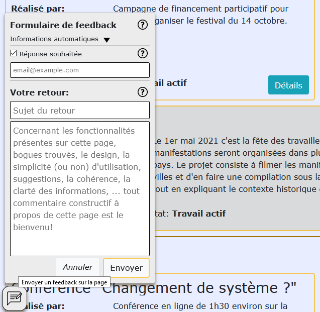

- **Un pack de données "Collectif Assoc Vaud"** (nom d'un collectif imaginaire aux objectifs vagues) est créé ayant des membres, groupes, projets, journaux de bord, travaux et tâches (ainsi que les tables join et participate). Ces données sont fictives (tout comme le collectif) mais doivent être en partie réaliste (cela pourrait être un cas réel). Le reste des données peut être généré de manière moins réaliste avec de l'aléatoire plus ou moins intelligent (avec diverses conditions rendant plus réalistes), et également du texte de remplissage (lorem ipsum) afin de simuler des petites et grandes quantités de textes (avec le moindre effort).
    - Dans ce pack, les membres données en exemple et pour tester l'application sont les 3 suivants: "Josette Richard (JRD)" admin, "Mégane Blan (MBN)" membre approuvée et "Vincent Rigot (VRT)" membre banni. Le projet contenant des données réalistes est le projet "**Crowdfunding Festival 2020**". Josette Richard est dans le projet et Mégane Blan est à l'extérieur (permettant ainsi de tester les différences entre l'intérieur et l'extérieur d'un projet)
    - Ce pack est chargeable en lançant le fichier `KanFF\db\db-manage\restore-db-kanff.bat` (ou en lancant les 2 fichiers SQL (voir readme.md), mais ne fonctionnent que si la base de donnée s'appelle "kanff"). Le fichier bat prend en compte d'autres noms de base de données.
    - Ce pack est généré à l'aide du script de génération **generationData.php** et se base sur les données écrites à la main dans les fichiers **basic-data-*.json** (* = nom de la table. Fichiers dit "basiques".). Le script de génération complète les données manquantes de celles fournies dans les fichiers de données basiques et en génère d'autres complétement aléatoire parfois (notamment pour les tâches). (Pour créer un pack pour un autre collectif imaginaire, il suffirait de changer ces fichiers basiques et de relancer le script, puis d'exporter la base de données en SQL).
     - Le pack contient un cea
    - Des tests rapides des fonctionnalités sont fait durant le développement par les développeur·euse·s et durant les sprint review pour les tests d'acceptation. Les fonctionnalités sont testées dans un cadre normal (utilisation standard) et aussi un peu en modifiant du code HTML et les requêtes HTTP, afin d'y insérer des valeurs qui doivent être validées et refusées si invalides (le javascript empêchant de le faire directement sur le formulaire parfois).
    - Test unitaires des fonctions du `CRUDModel.php`: testé avec `testCRUDmodel` dans différents contextes. Voici le résultat de l'execution:
    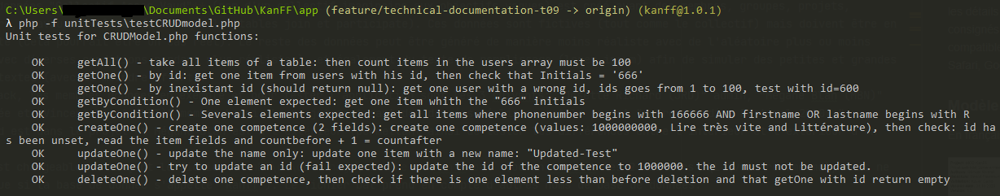

**Tests et demandes de feedback extérieurs.**
- **L'instance de test**:   
Afin de montrer et faire tester l'application, KanFF sera déployé sur une instance chez SwissCenter prêtée par le CPNV.  Le pack `Collectif Assoc Vaud` y est chargé. A chaque release l'instance est mise à jour et la base de données également. Un sous dossier temp est créé pour y uploader une version temporaire de l'application mise à jour fréquemment durant les périodes de tests pour permettre aux personnes qui testent de tester la version la plus récente (même si cela peut ne pas être stable, il est profitable de faire tester avec les toutes dernières améliorations qui ont été effectuées après la dernière release). Si la base de données doit être mise à jour, les données reviendront à zéro (celles du pack chargé).
    - Instance: [kanff.mycpnv.ch](kanff.mycpnv.ch)
    - Version plus récente temporaire (base de données séparée): [kanff.mycpnv.ch/temp/](kanff.mycpnv.ch/temp/).

Cela se passe en 3 phases:
- 1ère phase: 2 semaines avant la version 2.0 beta des premiers retours sont demandés à 6 personnes dans l'entourage proche, afin de ne pas réaliser des fonctionnalités inutiles ou de faire des grosses erreurs de conception quand à la gestion des projets et le reste des features.
- 2 ème phase: 1 semaine après la bêta 2.0, il sera demandé de faire à 10-15 personnes un retour approfondi de chaque page avec un accent sur la conception (en posant notamment des questions précises et plus vagues). Il y aura un moment pour corriger et améliorer selon les retours, avant de passer à la phase 3.
- 3 ème phase: Début décembre 2020, plusieurs collectifs seront informés de l'existence de l'application, de l'état du projet et pourront aller tester dans le but de voir si elle est adaptée à leur collectif et également faire des retours plus courts.

## Implémentation
### Vue d’ensemble
Pour l'instant, une instance KanFF ne peut contenir qu'un seul collectif. Chaque membre du collectif sur une instance doit se créer un compte pour accéder au collectif. Aucune donnée de projet, tâches, groupes, membres, ... n'est publique. Seule la page A propos est publique et contient des informations à propos du collectif, de l'instance et de KanFF.

L'application web s'utilise avec un navigateur via l'URL du serveur sur lequel est installé l'application. Une connexion internet active est requise pour charger les pages et effectuer des actions. L'application est adaptée à une utilisation sur ordinateur mais pas sur smartphone ni tablette. Le site n'est pas assez responsive et aucun test ne sera fait pour les navigateurs web mobile.

### Description technique
KanFF est une application web développée **en PHP** (HTML + CSS + Javascript + Ajax) **en MVC (Model View Controler)** avec une **base de données MySQL**. Les dépendances [npm](npmjs.com) utilisées sont bootstrap et jquery.

### Points techniques spécifiques
- **Stockage des dates:** Dans la base de données toutes les dates sont stockées en format DateTIme, peut importe si ce qui est affiché est précis à la minute ou la seconde (format naturel Date/Heure) ou alors précis au jour (format naturel Date).
- **Structure du repos:** Le [repository GitHub](github.com/samuelroland/KanFF) contient les éléments suivants
    - **PVs**: Procès Verbaux des réunions (pour les sprints reviews mais pas pour les sprints retrospectives)
    - **app**: le dossier contenant l'application, c'est le dossier racine du serveur
    - **db**: fichiers concernant la structure de la base de données (sources du MCD et MLD), le script de génération de données `generationData.php` et les packs de données, ainsi que les fichiers dit basiques.
    - **doc**: tous les fichiers de documentations (MCD + MLD + documentations techniques et liées et documentation utilisateur + maquettes).
    - **ressources**: fichier source des maquettes, fichiers du logo, fichiers txt de réflexion en cours.
    - **.gitignore**: fichier standardisé par git qui contient la liste des fichiers ignorés
    - **Journal.md**: Journal de bord du projet qui contient tous les événements importants et également les conclusions des sprints retrospectives.
    - **README.md**: fichier standardisé "Lisez-moi" expliquant ce qu'est KanFF, qui contient le logo, ainsi que des informations pour l'installation pour le développement et pour une instance de production.
- **Validation des actions importantes**: Afin de valider les actions importantes, comme la création ou la suppression d'un projet, d'un groupe, d'un compte, ... (liste non exhaustive), il est demandé, pour effectuer ces actions, de saisir son mot de passe. Ceci afin d'empêcher une action involontaire, une action d'une personne malveillante sur une session laissée ouverte sans surveillance, ou l'action de personnes malveillantes sur à un vol de cookies (identification possible avec les cookies mais mot de passe inconnu). Voir fonction checkUserPassword() ci-dessous.
- **Valeurs booléennes**: le type BOOL n'était pas pris en charge par MySQL, toutes les valeurs booléennes sont manipulées en type TINYINT (1bit donc valeurs possibles sont 0 ou 1) et ne sont pas converties (il n'y a pas de changement de type TINYINT vers BOOL et inversément). Dans toute l'application toutes les valeurs en TINYINT valant 0 signifie false et celles valant 1 signifient true. (Attention à ne pas mélanger avec les valeurs INT, par ex. users.state qui peut valoir de 0 à 8).
- **3 fichiers de fonctions d'aides (fichier help)**: `helpers.php` (fonctions générant du contenu commun), help.php (fonctions contrôleur communes), global.js (fonctions JS communes). Toutes ces fonctions sont décrites dans un document séparé [ici](doc/helpers-functions.md).
- **Login**: il est possible de se connecter avec un email, un nom d'utilisateur ou des initiales. Ces 3 valeurs sont donc uniques dans la base de données.
- **Contenu de la session**: se résume en le contenu de l'utilisateur connecté (sans mot de passe) et le flashmessage (qui reste temporairement dans la session). On peut donc savoir quel utilisateur est connecté en regardant dans `$_SESSION['user']`:  
  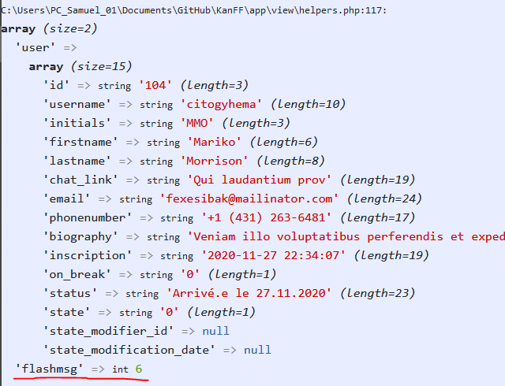
- **Génération unique des initiales**: Les initiales sont toujours stockées en majuscules. Le premier format est "première lettre du prénom + première lettre du nom + dernière lettre du nom" et le deuxième est "première lettre du prénom + première lettre du nom + deuxième lettre du nom". Si le premier format ne permet pas l'unicité, alors le 2ème format est appliqué. Si ce n'est toujours pas unique, il y a n'a pas d'autres formats prévus et la création du compte ne peut pas se faire... Cest la fonction `getUniqueInitials($firstname, $lastname)` qui s'en occupe.
- **Champs INT et constantes**: La base de données contenant de nombreux champs de type INT stockant diverses valeurs ayant une signification, il est indispensable de prévoir un moyen pratique pour développer sans connaître les valeurs INT mais uniquement en s'adaptant à leur signification, et pouvoir changer ou rajouter une nouvelle valeur en changeant uniquement le code dans un fichier help. Ceci concerne les champs state, type, visibility et need_help notamment.  
    - On définit des constantes PHP dans le fichier `helpers.php`:
        ```php
        define("TASK_STATE_TODO", 1);
        define("TASK_STATE_INRUN", 2);
        define("TASK_STATE_DONE", 3);
        ```
    - Puis on définit une autre constante qui est la liste des constantes ordrées logiquement (l'ordre sera visible dans les `<select>` notamment):
        ```php
        define("TASK_LIST_STATE", [TASK_STATE_TODO, TASK_STATE_INRUN, TASK_STATE_DONE]);
        ```
    - Puis on crée aussi une fonction qui va permettre de traduire les valeurs dans leur signification en français: `function convertTaskState($int, $needFirstCharToUpper = false)`
    - Ainsi quand on reçoit les valeurs de la base de données ou d'ailleurs en INT et qu'on veut avoir la signification en français (pour l'afficher par ex), on appelle `convertTaskState($task['state'])`pour avoir "en cours" par ex.
    - Dans le code on n'utilise jamais les valeurs brut (1, 2, 3, ...) on utilise uniquement les constantes (par ex. un if `if ($task['state'] == TASK_STATE_DONE)` et pas `if ($task['state'] == 3)`), comme ca si la valeur 3 change de signification il y aura peu de code à modifier.
    - Les différentes valeurs possibles et leurs significations sont décrites de manière détaillées dans [les spécifications de la base de données](db-specifications.md). Les constantes correspondantes peuvent être trouvées dans `helpers.php`. Elles sont toujours nommées de la manière suivante: `TABLE_CHAMP_SIGNIFICATION` par ex. `USER_STATE_BANNED` ou `GROUP_VISIBILITY_TITLE`. Les constantes "liste" sont nommées `TABLE_LIST_CHAMP` par ex. `GROUP_LIST_STATE` ou `WORK_LIST_NEEDHELP`.
- **Mode debug:** le mode debug permet d'afficher les var_dump() lancés par un remplacement `function displaydebug($var, $needPrint_r = false)`. la variable $debug dans `.const.php` doit être définie à `true` pour que les var_dump() s'affichent. Ce qui est très pratique pour faire du debug sans impacter le code pour tout le monde ainsi que pour la production (et donc pouvoir activer/désactiver l'affichage var_dump() est très pratique en développement).
- **`CRUDModel.php`:** ce fichier implémente une série de fonctions permettant d'effectuer des actions CRUD (Create Read Update Delete) avec la base de données. Des fonctions `Query()`, `getAll()`, `getOne()`, `getByCondition`, `createOne()`, `updateOne()`, `deleteOne()` sont implémentées afin de ne plus devoir gérer PDO dans d'autres fichiers model et pouvoir souvent éviter d'écrire du SQL quand la requête est "standard". Ces fonctions sont décrites dans [les spécifications de la base de données](db-specifications.md).
- Le fichier `.const.php` des informations pour la base de données ainsi que d'autres configurations propres aux machines.
- **L'extension PDO** est utilisée pour faire les requêtes SQL sur la base de données MySQL. L'extension doit être activée dans le fichier `php.ini` (voir readme).
- **Types de vue**: les types de vues pour le gabarit permettent d'adapter la zone du gabarit prévue pour la vue. Valeurs possibles:
    - `full`: simple marge `p-1`: pour les pages qui doivent la totalité de l'espace disponible.
    - `large`: simple marge `p-3`: pour la plupart des pages avec une marge standard
    - `restricted`: largeur maximum définie, zone centrée et marge `p-3`: pour les pages d'informations ou avec peu d'éléments.
- **Messages affichables**: Il y a 2 types de messages affichables: Les **flashmessages** affichés en haut du gabarit ou dans une vue directement, **les "messages API"** qui sont renvoyés après une requête Ajax et affichés dans des `jsTempMsg`. Dans les 2 cas cela permet d'avertir l'utilisateur d'une erreur ou de la réussite pour une action. Tous ces messages doivent être stockés dans le fichier `messages.json`. Un seul message par requête est possible.
    - Format d'écriture des messages:  
    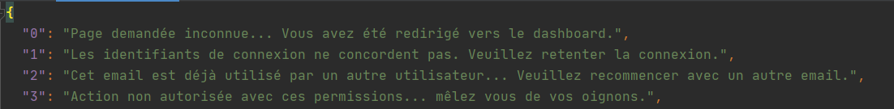
    - Exemple flashmessage:
    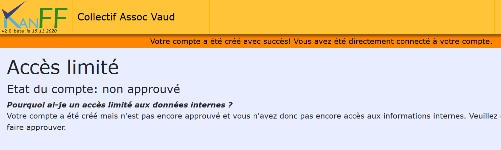
   - Exemple message API:  
    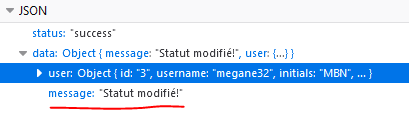
    - Fonctionnement des flashmessages:
        - Le numéro du flashmessage est stocké dans la session avec `flshmsg($number)` appelé depuis une fonction contrôleur ou l'index (ce qui définit quel sera le flashmessage pris par son numéro). (Plus simple que d'y accéder directement dans la session).
        
        - Si on veut afficher le message à un endroit précis dans la vue (sous le titre ou vers le bouton submit, par ex), on peut chercher ce message avec `flashMessage($withHtml = true)` et sans passer directement par la session (sinon le message ne sera pas supprimé en passant par `flashMessage()`). Si on veut laisser l'emplacement par défaut (sous le menu), on laisse le gabarit se charger d'afficher le message.
    - Affichage des messages API:
        - Les messages API sont affichés à l'aide de la fonction `displayResponseMsg(val, checkmark = true, color = "black")` en JS. Ce sont des messages temporaires qui disparaissent après quelques secondes (appelé `jsTempMsg`). Plusieurs messages peuvent être affichés à la fois.
        - Exemple de 2 `jsTempMsg` (avec checkmark `false` puis `true`):  
        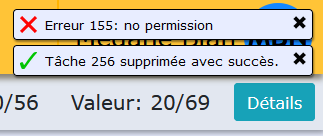
- **Couleurs logo**: 
    - Codes couleurs hexadécimaux:
        - Bleu foncé: `#38417f`
        - Bleu clair: `#4fb6e3`
        - Vert: `#348a19`
    - Classes CSS pour arrière fond avec couleurs du logo:
        - Bleu foncé: `darkbluelogo`
        - Bleu clair: `lightbluelogo`
        - Vert: `greenlogo`
    - Classes CSS pour couleur du texte avec couleurs du logo:
        - Bleu foncé: `txtdarkbluelogo`
        - Bleu clair: `txtlightbluelogo`
        - Vert: `txtgreenlogo`
- **Les tooltips**: ce sont les petits encadrés qui apparaissent au survol et qui contiennent du texte. Ils sont très utilisés pour les icônes d'aide ("?") afin d'expliquer rapidement le but ou le fonctionnement d'une fonctionnalité ou d'un champ, mais aussi pour mentionner des membres et à d'autres occasions.
    - Exemples:  
        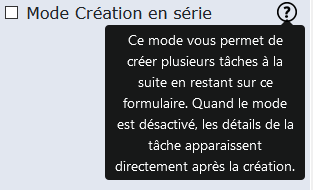
        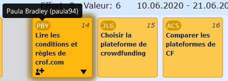
    - On les crée avec la fonction `createToolTip($innerText, $tooltipText, $link = false, $type = "top")`. Si c'est un tooltip sur une icône d'aide, alors on peut directement utiliser `createToolTipWithPoint($tooltipText, $pointClasses = "icon-small m-2", $link = false, $type = "top")`.
- **Afficher des icônes**: pour ne pas avoir besoin de constamment réécrire le HTML pour créer une icône, il existe la fonction `printAnIcon($iconname, $title, $alt, $defaultClasses = "icon-small ml-2 mr-2", $echo = true, $id = "", $hidden = false)`. Des classes CSS par défaut sont donc appliquées.
- **Le dropdown user**: est la petite zone qui s'affiche avec un clic sur les initiales de la personne connectée.
    - Aperçu:  
    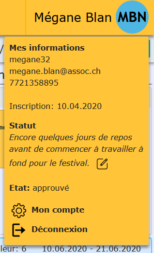
- **Mots de passe**: les mots de passe des membres sont hashés et salés avec la fonction `password_hash($password, PASSWORD_DEFAULT);`. Les mots de passe doivent respecter une Regex (regex stockée dans la constante `USER_PASSWORD_REGEX` et la description est stockée dans `USER_PASSWORD_CONDITIONS`)
- **Les regex (expressions régulières)**: sont stockées dans des constantes dans le format sans "/" de départ et de fin (compatible en HTML et JS). Les "/" sont nécessaires en PHP. La fonction `checkRegex($string, $regex)` existe en PHP et `testRegex(regex, string)` existe en JS. Pour tester des regex pour un certain type de valeur (nom, email, username, ...), des fonctions sont créées parfois. Par ex. `isEmailFormat($text)`.

### Sécurité
Le logiciel étant destiné à la production, il doit y avoir plusieurs tests de sécurité avant de pouvoir publier en production. Dans l'idéal ces tests seraient automatisés et potentiellement fait par un logiciel externes (pour ne pas devoir les inventer nous même). En dehors de certains fonctionnalités dont la sécurité est assurée déjà un minimum par validation des permissions et bloquage des injections SQL car directement appliqué à chaque fois, il y a diverses autres failles (dont XSS) qui sont facilement exploitable...  
Des détails sur ces tests, failles, corrections et checklist arriveront plus tard dans le projet...

### Livraisons
Il y a 3 publications majeures et d'autres petites entre deux. Une publication est faite à la fin de chaque sprint sur GitHub. (Seulement les tags sont affichés ici). Pour voir les releases et leur description, suivez le lien de l'image.

[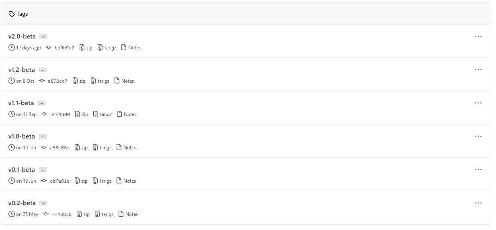](https://github.com/samuelroland/KanFF/releases)

### Erreurs restantes
Les erreurs décrites ci-dessous concernent la version actuellement (`v2.0-beta`) implémentée uniquement sur les stories terminées. (Les stories en cours contenant des tonnes d'erreurs et de partie non terminées, dû au manque de temps, ne sont pas incluses dans la liste):
- Les initiales devraient avoir d'autres formats possible et mieux avertir l'utilisateur du problème.
- Il y a des erreurs dans la console JS dû à une déclaration des événements sur chaque page au lieu de pages ciblées.
- Le texte d'explications des fonctionnalités est parfois trop long et mal écrit. Il faudrait le réécrire en demandant des avis extérieurs.
- Le menu n'est pas responsive et ne s'adapte pas sur écran restreint. Il est cassé et la plupart des boutons deviennent invisible. Il faudrait gérer les options et l'affichage du menu pour les écrans moins larges.

## Conclusion
Cette conclusion est faite à la fin du module Projet Web+BDD (`v2.0-beta`) et l'état des lieux ne concerne donc que ce moment-là.

### Objectifs atteints
- Gestion des membres basiques (création compte, connexion, changement d'état),
- Début de la gestion des projets (kanban, détails d'un projet)

### Objectifs non-atteints
- Gestion des groupes (juste liste des groupes en cours et créer un groupe encore en cours) manquante.
- Gestion complète des membres (édition du compte, détails d'un membre, ...) pas terminée.
- Gestion complète des projets (projets, travaux et tâches) pas terminée.

Une instance ne peut héberger qu'un seul collectif.

## Annexes
### Sources – Bibliographie
<!--
Liste des livres utilisés (Titre, auteur, date), des sites Internet (URL) consultés, des articles (Revue, date, titre, auteur)… Et de toutes les aides externes (noms)
-->
- [php.net](https://php.net): Documentation officiel PHP
- [stackoverflow.com](https://stackoverflow.com)
- [w3schools.com](https://w3schools.com)
- [sql.sh](https://sql.sh): Documentation officiel SQL
- M. Carrel pour aide et conseils
- M. Ithurbide pour les conseils en gestion de projet.

### Journal de bord du projet
Le journal de bord se trouve sur GitHub ([voir `Journal.md`](../Journal.md)) et contient tous les événements importants, décisions, changements, documentations, ...
