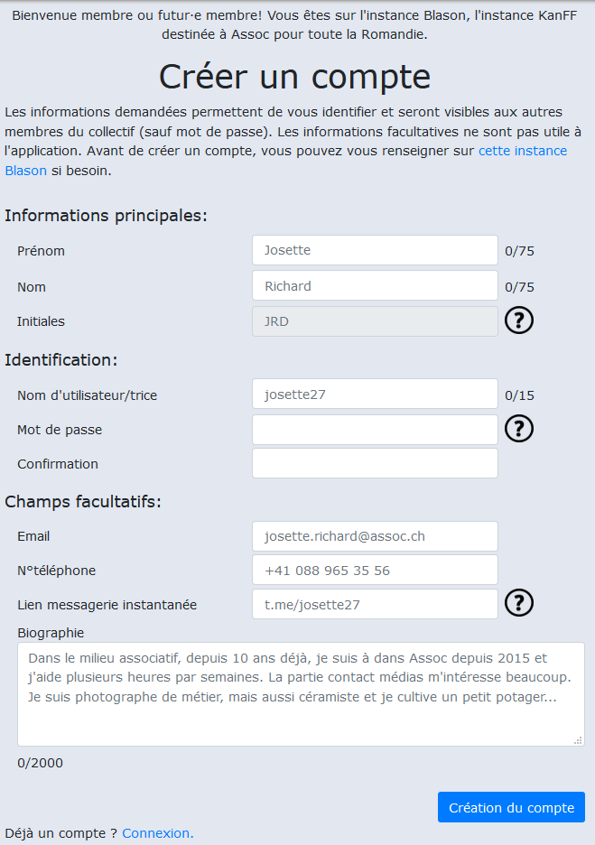
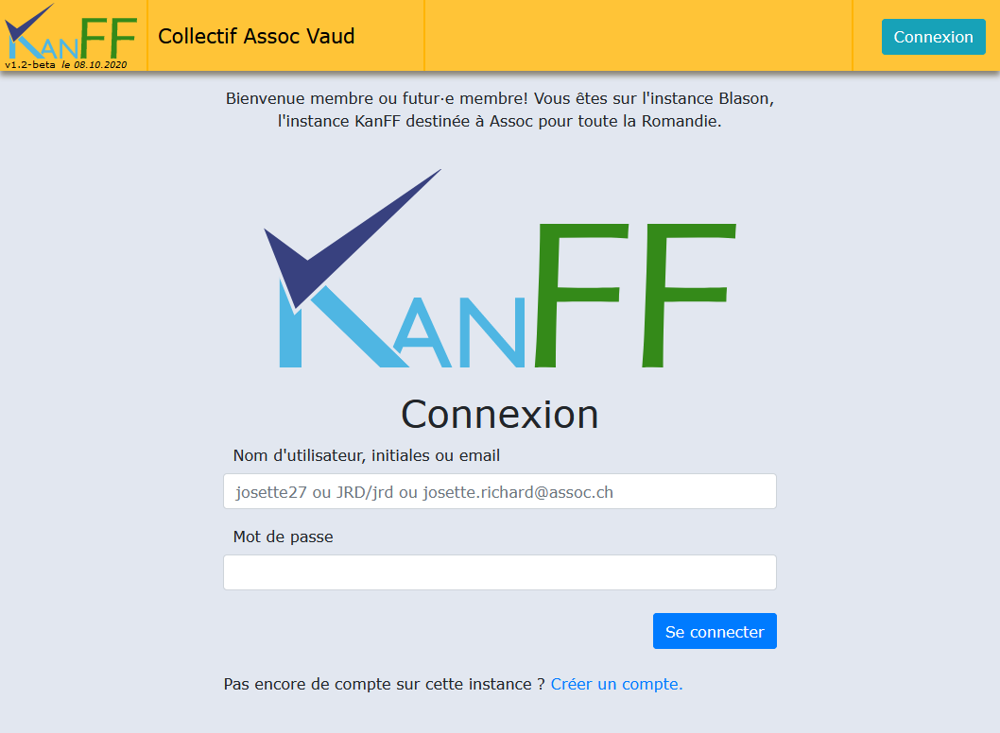
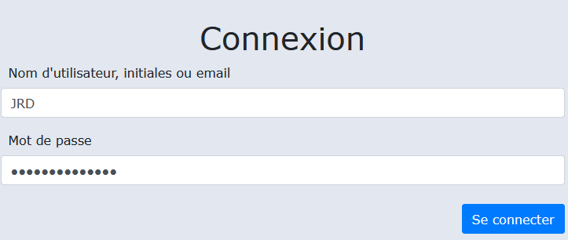
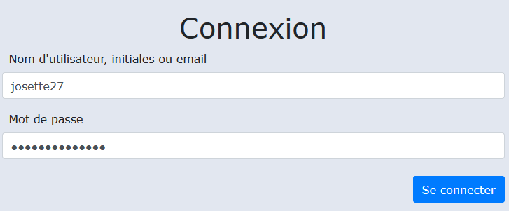
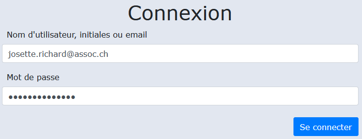

/**
 *  Project: KanFF
 *  File: kanff-doc-user-fr.md kanff user doc source
 *  Author: Samuel Roland
 *  Relecture: 
 *  Creation date: 22.10.2020
 */
 
# Mode d'emploi

## Table des matières

## Introduction
Ce mode d'emploi vous explique de la manière la plus concise comment utiliser l'application web KanFF. Si vous recherchez des informations sur le projet, la documentation technique, vous les trouverez ici [ADDLINK]
Ce document est adapté pour un maximum de niveaux différents en informatique. Les personnes les plus à l'aise iront directement lire les chapitres qui les intéressent et les autres personnes iront pas à pas en s'aidant des captures d'écran.

## Contexte d'utilisation
Vous êtes membre d'un collectif, d'un groupe, d'un mouvement social, une association, ... (appelé ici "collectif" afin de simplifier) et votre collectif est inscrit sur une instance KanFF ? Vous aimeriez être guidé pour vos premiers pas ? Alors vous êtes au bon endroit.

## Mini-dictionnaire:
- Données internes: toutes les informations stockées dans l'application incluant les membres, les groupes, les projets, les travaux, les tâches, concernant un collectif. Ces données ne sont pas publiques mais accessibles uniquement aux membres du collectif.
- Instance: serveur sur lequel est installé KanFF. L'instance est accessible via une **URL** (`blason.com` par ex.) et a un **nom** donné par la personne la gérant (par exemple `Blason`)
- Admin: 
- URL: Lien internet vers une ressource stockée sur internet (site web, fichier, ...).

###
- Projets: 
- Travaux:
- Tâches:

## A quoi ça sert ?
KanFF vous permet de gérer des projets et des tâches, réalisés par des groupes incluant des membres, au sein d'un collectif et de manière collaborative.

    Oui mais gérer comment ?

Gérer signifie: créer, afficher, modifier et supprimer. Vous pouvez faire ces 4 actions sur quasiment toutes les données internes.

## Un peu d'imagination:
Dans ce mode d'emploi, nous allons prendre un exemple concret:  
**Josette Richard** a créé un collectif appelé `Collectif Assoc Vaud` il y a 2 mois avec 2 autres personnes: **Vincent Rigot** et **Mégane Blan**. Le collectif a pour but d'organiser des événements et actions tentant de faire converger diverses luttes. Le collectif démarre à très peu de personnes mais de nombreuses se montrent intéressées à rejoindre. Ensemble il a été décidé d'utiliser KanFF pour gérer les projets collaborativement et faire grandir le collectif.

Josette a trouvé une instance qui a accepté d'y inscrire le collectif. C'est l'instance `Blason` à l'URL `kanff.blason.com`.
Mégane et Vincent doivent maintenant rejoindre cette instance en y créant un compte. Mégane d'abord, accède à `kanff.blason.com` avec son navigateur web. 

## Compte utilisateur·ice:
Pour accéder aux données (membres, groupes, projets, tâches, ...) d'un collectif vous devez avoir un compte et vous faire approuver par votre collectif. Votre compte est propre à une instance et ne peut pas être utilisé sur une autre instance.

### Créer un compte:
- Aller sur la page `Créer un compte` avec le lien en bas de la page de connexion:

- Remplir le formulaire:
    - Les informations principales et d'identification sont obligatoires, elles permettent de vous identifier lors de la connexion.
    - Le reste est facultif et uniquement à titre d'information pour les autres membres du collectif, qui peuvent d'ailleurs voir toutes les informations que vous rentrer (excepté le mot de passe évidemment). A vous donc de choisir ce que vous inscrivez comme information ou pas. Ne mettez pas d'information sensibles, notamment dans la biographie...

Quelques informations supplémentaires quant aux champs du formulaire:
- Certains champs sont limités en taille.
- Le mot de passe vous est demandé 2 fois pour empêcher les fautes de frappes.
- Les signes "?" vous donnent une information supplémentaire qui peut vous aider.
- Les initiales sont uniques et générées automatiquement selon un format simple (première lettre du prénom + première lettre du nom + dernière lettre du nom)

### Se connecter:
- Aller sur la page `Connexion` qui est la première page visible en arrivant sur l'instance.

#### 3 manières différentes de se connecter:
- Avec ses initiales (les initiales peuvent aussi être en minuscules, il n'y a pas de différence)

- Avec son nom d'utilisateur·ice

- Ou avec son email

... et bien sûr son mot de passe obligatoire!

